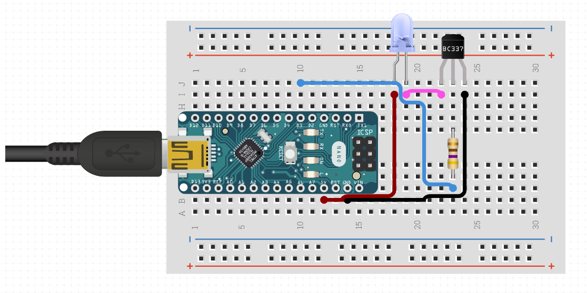

This is the code to build and IR remote for LG TV Model-32LJ522D. It uses IRremote library to send IR signals.

**Note :** *IR Codes.txt* contains the mapping of keyboard characters to remote hex code that I used in the program. 

## **Circuit**

## **Resources**
### Arduino PWM Pin:
    https://reference.arduino.cc/reference/en/language/functions/analog-io/analogwrite/
    https://docs.arduino.cc/tutorials/generic/secrets-of-arduino-pwm

### Read about NEC Protocol: 
    https://techdocs.altium.com/display/FPGA/NEC%2bInfrared%2bTransmission%2bProtocol

### LG TV Remote Hex Code
    https://tasmota.github.io/docs/Codes-for-IR-Remotes/#ir-codes-tv-lg-55uh8509

